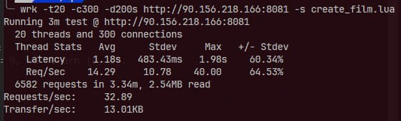
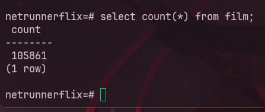
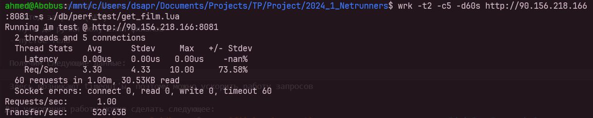
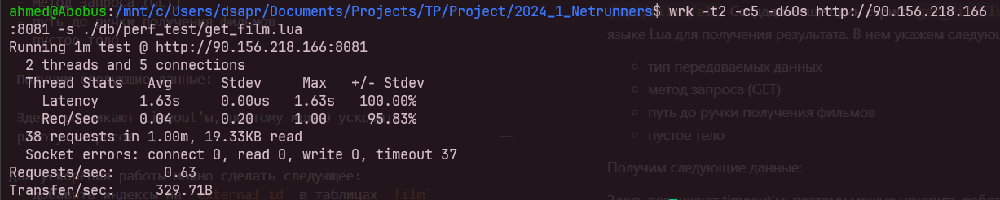

# ДЗ 3 - Оптимизация работы СУБД

Для нагрузочного тестирования будем пользоваться утилитой wrk.

Основная сущность в приложении для просмотра кино - фильм => будем тестировать именно ее. Для этого заполним базу данных 100 тысячами фильмов, а затем попробуем взять препью лучших фильмов.

1) Создадим 100 тысяч записей. Для этого будем отправлять запросы на ручку `/api/films/all` с помощью скрипта на языке Lua из файла `create_film.lua`. В нем укажем следующее:
    - тип передаваемых данных
    - метод запроса (POST)
    - путь до ручки добавления фильма
    - сам фильм в теле запроса

    По итогу получим следующие показатели:
    
    

    Они далеки от идеала из за того, что мы используем свой сервер из за проблем с тем, что был выделен изначально.

    В базе видно, что есть более 100 тысяч записей:

    

2) Теперь проведем тестирование получения фильмов по ручке `/api/films/all`. Создадим еще один скрипт `get_film.lua` на языке Lua для получения результата. В нем укажем следующее:

    - тип передаваемых данных
    - метод запроса (GET)
    - путь до ручки получения фильмов
    - пустое тело

    Получим следующие данные:

    

    Здесь возникают timeout'ы, поэтому можно ускорить работу запросов

3) Для ускорения работы можно сделать следующее:
    - добавить индексы на `external_id` в таблицах `film` и `comment`, так как это используется в *join* и *group by*
    - добавить индексы на `title`, `banner` в таблице `film`, так как это используется в *group by*

    По итогу видно, что скорость увеличилась почти в два раза:

    